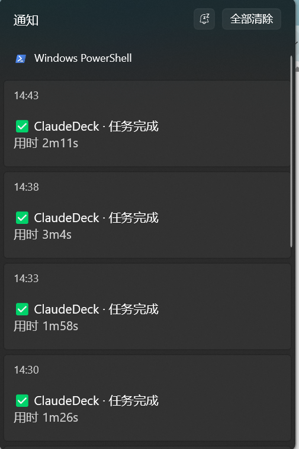
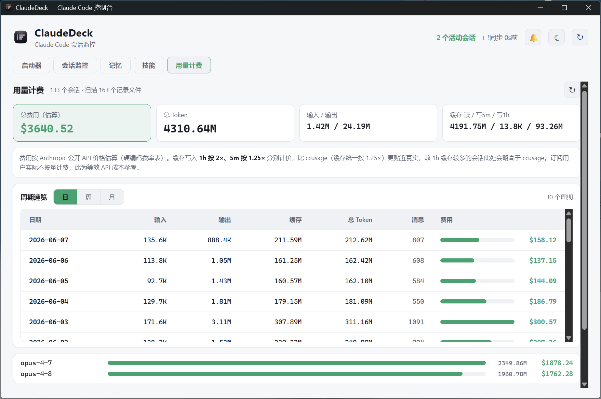

# ClaudeDeck

> Claude Code 的本地控制台 —— **会话监控 + 完成通知 + 记忆可视化 + 技能管理 + 用量计费**桌面应用。

把散落在 `~/.claude/` 里的状态，变成一块可视化的「驾驶舱」。数据源全部来自本机 `~/.claude/`，无需逆向、无需 hack。

## 功能

- 📡 **会话监控** ✅ — 实时显示哪些 Claude Code 会话在运行 / 空闲 / 等待输入 / 疑似卡死，跑在哪个项目、用了多久。
- 🔔 **完成通知** ✅ — 长任务跑完或需要授权时，**桌面弹窗 + 声音**提醒（可设阈值，过滤短问答）。
- 📱 **手机推送** ✅ — 应用内**一键安装** Claude Code hook，把「任务完成 / 等待授权」推到手机（**Bark / iPhone** 或 **PushPlus / 微信**），**应用不用开着也能收到**。
- 🧠 **记忆可视化** ✅ — 统一面板查看 / 编辑全局 + 项目级记忆：auto-memory 按 frontmatter 自动分类成卡片、`[[name]]` 渲染成**力导向关系图**、Markdown 渲染全局 `CLAUDE.md` 与项目 `MEMORY.md`，支持**编辑回写 + 删除（带回收站，可还原）+ 空目录清理**。
- 🧩 **技能管理** ✅ — 可视化浏览 `~/.claude/skills/`：卡片查看 SKILL.md、展开看**文件结构树**（含 references）、**标签管理 + 筛选 + 搜索**、一键在资源管理器打开 skill 目录。
- 💰 **用量计费** ✅ — 统计每个会话的 token 消耗与**等效 API 费用**（按费用高→低排序 + 总计 + 按模型分布），并提供**日 / 周 / 月速览**。费率内置、离线可用；缓存写入按 1h(2×)/5m(1.25×) 分别计价，更贴近真实。
- 🚀 **Claude 启动器** ✅ — 记录最近用过的工作目录，双击即在该目录开新会话，可选「启动前注入代理等环境变量」。

## 平台

目前仅在 **Windows 11** 实测。macOS / Linux 理论可用（Tauri 跨平台），但 `~/.claude/` 路径编码规则尚未在这两个平台验证。

## 下载使用（免安装）

到 [Releases](https://github.com/XueTianyu24/ClaudeDeck/releases) 下载 **`ClaudeDeck.exe`**，**Windows 11 双击即用**，免安装、免配置。

- 首次运行被 Windows SmartScreen 拦截是未签名应用的正常现象 → 点「更多信息」→「仍要运行」。
- 依赖 WebView2 运行时（Win11 自带，无需额外安装）。
- 想要安装版（进开始菜单、可卸载）：下载 `ClaudeDeck_*_x64-setup.exe`。

## 从源码运行（开发）

### 环境要求

- [Node.js](https://nodejs.org/) 18+
- [Rust](https://www.rust-lang.org/tools/install)（Tauri 后端，首次编译较久）
- Windows 需 WebView2（Win11 自带）+ MSVC 构建工具

### 开发模式

```bash
npm install
npm run tauri dev        # 启动桌面开发模式，首次编译 Rust 请耐心等
```

### 打包

```bash
npm run tauri build      # 免安装 exe: src-tauri/target/release/ClaudeDeck.exe；安装包: target/release/bundle/
```

## 使用

启动后窗口会列出当前所有 Claude Code 会话（读 `~/.claude/sessions/*.json`，3 秒刷新）：状态、项目、PID、运行时长、最后心跳、版本。点右上角 🔔 配置通知（完成阈值、等待提醒、静音、提示音时长），右上角 ☀/☾ 切换深浅色主题。

顶部「记忆」标签进入**记忆可视化**：左栏切换全局 `CLAUDE.md` / 各项目 / 回收站；项目内可在「卡片 / 关系图 / 📑 索引」间切换，卡片按类型分组、点击展开正文、`[[关联]]` 可跳转；卡片可**编辑 / 删除**（删除进回收站可还原），删空的项目可**物理清理空目录**。

长任务完成时的 Windows 桌面通知（带用时）：

<p align="center"></p>

顶部「用量计费」标签：统计每个会话的 token 消耗与等效 API 费用（按费用排序 + 总计 + 按模型分布），并可切换**日 / 周 / 月**速览。费用为按 Anthropic 公开 API 价的估算（内置费率表，离线可用；缓存写入按 1h 2×、5m 1.25× 分别计价），订阅用户实际不按量计费，此处为等效成本参考。

<p align="center"></p>

## 手机推送配置（Bark / 微信 / ntfy）

> 支持 **Bark（iPhone，免费）/ PushPlus（微信，安卓首选）** 两渠道，在应用里 🔔 →「📱 手机推送」选渠道填 key 即可。完整配置（含微信 PushPlus 的实名认证约 4 元 / 关闭服务号免打扰等坑）见 **[手机推送渠道指南](docs/push-channels.md)**。下面以 Bark 手动配置为例。

<p align="center"></p>

让 Claude Code 任务完成时推送到手机，**不依赖本应用常驻**——靠 Claude Code 原生 hook 在会话进程内触发。

**最简单**：打开应用 → 右上角 🔔 →「📱 手机推送」卡片，选渠道、填 key → 点「安装」即可（自动写好脚本和 settings.json，可一键卸载）。以下手动步骤供不用本应用、或想自行配置时参考。

1. **装 Bark**：iPhone App Store 搜 [Bark](https://github.com/Finb/Bark)，打开后首页有你的专属地址 `https://api.day.app/<你的KEY>/`，记下 `<你的KEY>`。
2. **放脚本**：把本仓库的 [`hooks/claudedeck-bark-notify.ps1`](hooks/claudedeck-bark-notify.ps1) 复制到 `~/.claude/hooks/`，把里面 `PUT_YOUR_BARK_KEY_HERE` 改成你的 KEY。
   - ⚠️ 该文件**必须保存为 UTF-8 with BOM**，否则 Windows PowerShell 5.1 读中文会乱码。
3. **挂 hook**：把下面片段合并进 `~/.claude/settings.json` 的顶层（改前先备份）：

```json
{
  "hooks": {
    "UserPromptSubmit": [
      { "hooks": [ { "type": "command", "command": "powershell.exe -NoProfile -ExecutionPolicy Bypass -File C:/Users/你的用户名/.claude/hooks/claudedeck-bark-notify.ps1", "timeout": 10 } ] }
    ],
    "Stop": [
      { "hooks": [ { "type": "command", "command": "powershell.exe -NoProfile -ExecutionPolicy Bypass -File C:/Users/你的用户名/.claude/hooks/claudedeck-bark-notify.ps1", "timeout": 10 } ] }
    ],
    "Notification": [
      { "matcher": "permission_prompt", "hooks": [ { "type": "command", "command": "powershell.exe -NoProfile -ExecutionPolicy Bypass -File C:/Users/你的用户名/.claude/hooks/claudedeck-bark-notify.ps1", "timeout": 10 } ] }
    ]
  }
}
```

4. **新开一个 Claude Code 会话**让 hook 生效，派个 ≥30 秒的活试试。

工作原理：`UserPromptSubmit` 记本轮起点 → `Stop` 算时长，满 30 秒（阈值，过滤短问答）才推「✅ 任务完成 / 用时」→ `Notification` 在 Claude 卡着等授权时推「⏳ 需要你处理」。想换 ntfy（Android / 自建）或微信推送，改脚本里的 curl 目标即可。

## 架构

- **Tauri 2 + React + TypeScript + Vite**：Rust 后端读 `~/.claude/`、常驻线程检测会话状态翻转、发系统通知；前端做面板与可视化。
- 包体小、内存低、原生系统通知 + 本地文件访问无浏览器沙箱限制。

> ⚠️ Claude Code 的 `sessions/*.json`、`*.jsonl` 是内部私有格式、随版本漂移，无官方契约。本项目全字段容错解析 + 失败降级，但不保证对所有版本永远适配。

## 路线图

- [x] 手机推送 GUI 一键安装 / 卸载（应用内填 Bark key，自动写脚本 + settings.json）
- [x] 记忆可视化面板（分类卡片 + 力导向关系图 + Markdown 渲染 + 编辑回写 + 删除/回收站 + 空目录清理）
- [x] 技能管理（SKILL.md 查看 + 文件结构树 + 标签管理/筛选/搜索 + 打开目录）
- [x] 手机推送多渠道（Bark / 微信 PushPlus）选择
- [ ] 会话行展开看最近消息
- [ ] macOS / Linux 路径编码适配
- [ ] 在线更新（`tauri-plugin-updater`，从 GitHub Releases 拉新版自动提示；需配套签名密钥，待核心稳定后做）

## 许可

[MIT](LICENSE) © 2026 雪天鱼
