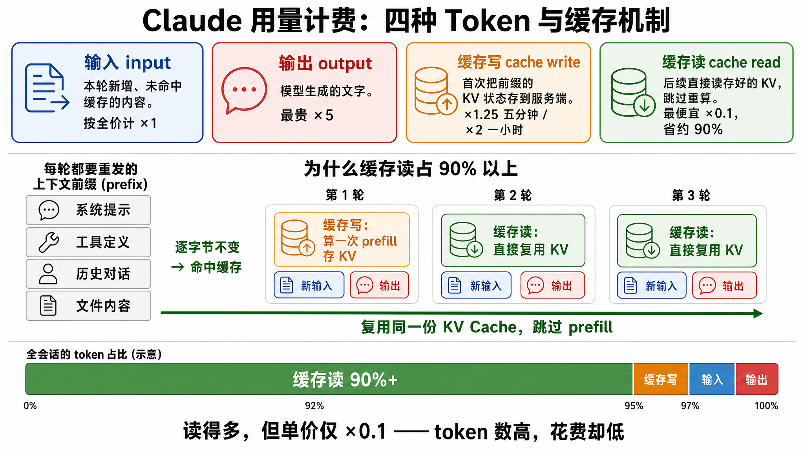

# 用量计费里的四种 Token —— 看懂 Claude 的账单

ClaudeDeck「用量计费」标签把每个会话的 token 消耗拆成 **输入 / 输出 / 缓存写 / 缓存读** 四类。很多人第一次看会困惑：**为什么 90% 以上都是「缓存读」？是不是只有输入输出才算真正的用量？** 这篇说明把原理讲清楚。

> 数据来源：扫描 `~/.claude/projects/*/*.jsonl` 里每条 assistant 消息的 `message.usage`（一个 jsonl = 一个会话）。

## 四种 Token 是什么

| 类型 | `message.usage` 字段 | 单价（相对输入基准）| 含义 |
|---|---|---|---|
| 输入 | `input_tokens` | ×1（Opus 4.8 = $5/M）| 本轮**新增、未命中缓存**的内容 |
| 输出 | `output_tokens` | ×5（$25/M）| 模型生成的文字，单价最贵 |
| 缓存写 | `cache_creation_input_tokens` | ×1.25（5 分钟）/ ×2（1 小时）| 首次把一段前缀的 KV 状态**存到服务端** |
| 缓存读 | `cache_read_input_tokens` | **×0.1**（$0.5/M）| 后续请求**直接读**存好的 KV，省约 90% |

> 费率以 Anthropic 公开 API 价为准（Opus 4.5–4.8 = $5/$25）。订阅用户实际不按量计费，应用里的金额是**等效成本参考**。

## 为什么 90% 以上是缓存读

如果你了解 Transformer 的 **KV Cache**：prefill 阶段把整段 prompt 的 K、V 算出来，decode 时每步读取整个 KV Cache。**Anthropic 的 prompt cache 本质就是把这份 KV Cache 跨请求持久化到服务端。**

关键在 Claude Code 这种**多轮 agent 会话**的请求结构：每一轮都要把 **系统提示 + 工具定义 + 整段历史对话 + 文件内容** 整个重发一遍。这一大段**前缀（prefix）逐字节不变**：

- **第 1 轮**：算一次 prefill，把 prefix 的 KV 存下来 → 记一次 `cache_write`
- **第 2、3 … N 轮**：prefix 没变，服务端**直接加载存好的 KV、跳过 prefill** → 每轮记一次 `cache_read`；只有那点「新用户消息 / 新工具结果」才算 `input`

所以一段 10 万 token 的上下文被读 50 轮 = 500 万 `cache_read` token，而每轮真正新增的 `input`+`output` 才几百到几千。**按 token 数算，缓存读自然碾压式占 90% 以上。**

## 两个常见误解

**误解 1：缓存读是「每步 decode 都读一次所以变大」。**
不是。`cache_read_input_tokens` 是**每个请求记一次**，数值 = 这次命中缓存的**前缀长度**，不乘 decode 步数、也不乘输出长度。「每步 decode 读整个 KV」是 GPU 内部那次访问 —— 那是**不计费**的物理机制。计费的 cache_read 之所以大，纯粹是因为**同一份大前缀每一轮都被重新计一次**，几十上百轮累加起来才大。

**误解 2：只有输入输出才是「有价值」的用量。**
要分场景：

- **想看「这一轮真正新干了多少活」** → 对，`input`+`output` 才是每轮的新增信号，缓存读写是「重复搬运旧上下文」。
- **想看「钱花哪了」** → ❌ 不能忽略缓存读。它单价虽只有 ×0.1，但量太大，**实际美元成本里它经常是最大的一项**。单价比：输出 $25/M、缓存读 $0.5/M，差 50 倍；只要 `缓存读 token / 输出 token > 50`（长 agent 会话轻松到 100:1），缓存读的**花费就超过输出**。

而且**缓存读高其实是好事**：说明缓存命中了，这段上下文你按 ×0.1 在付，而不是按 ×1，等于省了约 90%。反过来，如果某段会话 `cache_read` 接近 0、几乎全是 `input`，说明缓存没命中，正在花 **10 倍**的钱。

## 一句话总结

> **`input` / `output` 反映「真实新增工作量」，`缓存读` / `缓存写` 反映「上下文复用规模与省钱效果」。** 看不同的问题，就看不同的列 —— 别用单一指标下结论。

## 计费方法学（实现细节）

ClaudeDeck 的算法参考 [ccusage](https://github.com/ryoppippi/ccusage) 金标准并做了打磨：

1. **费率表硬编码**，与 ccusage 内置值逐位一致，离线优先；
2. 缓存写入**拆 1h(×2) / 5m(×1.25)** 分别计价（比 ccusage 统一 ×1.25 更准），老格式无拆分字段则整块按 5m 兜底；
3. 全局按 `message.id + requestId` **去重**（resume/fork 会重复写入）；
4. 跳过 `<synthetic>` 合成消息；
5. 模型名归一化（`.`/`@` → `-`、剥 provider 前缀）+ 同族 fallback。

日 / 周 / 月速览按 entry 粒度 + 本地时区分日桶（跨午夜正确归属），周 / 月从日桶再聚合。
